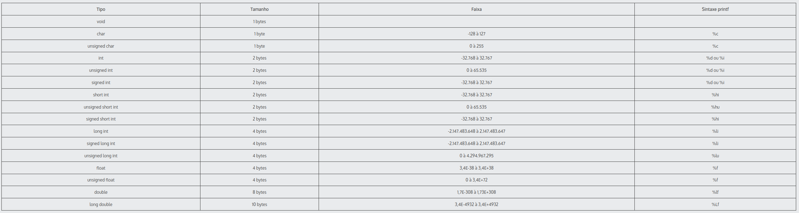

# Learning C Programming Language

Programas criados durante os estudos de aprendizado da linguagem C

## Compilador

Durante os estudos, foi utilizado o **gcc** para compilar os códigos, em uma máquina rodando o **ubuntu 20.04 LTS**. \
Para instalar o compilador, basta executar o comando abaixo: \
**OBS.: Para outras versões de linux, pode ser necessário instalar outras bibliotecas e programas;** \
**OBS. 2: Para outros S.O.s como windows e mac, consulte na internet a forma apropriada de instalar nos mesmos;**

> $ apt install -y build-essentials

## Compilando e Rodando

A compilação de programas em **C** e consequentemente a execução do mesmo, você poderá fazer usando uma série combinações de arquivos e parâmetros, pois tudo vai depender
do que você quer fazer e executar com o seu programa criado em **C**. \
Nesta sessão, vamos anotar apenas os comandos práticos utilizados durante o aprendizado: \

**Compilar código:**
> $ gcc ./<nome_do_programa.c>

**Executar código compilado:**
> $ ./<nome_do_output_do_programa>

**Compilando e mudando nome do output do programa:**
> $ gcc -o ./<nome_do_programa> ./<nome_do_programa.c>

**Compilando e exibindo mensagens de warnings durante a compilação:**
> $ gcc -Wall -o ./<nome_do_programa> ./<nome_do_programa.c>

**Compilando e executando código ao mesmo tempo:**
> $ gcc -Wall -o ./<nome_do_programa> ./<nome_do_programa.c> && ./<nome_do_programa>

**Compilando e executando código com headers:**
> $ gcc -Wall -o ./<nome_do_programa> ./<nome_do_programa.c> ./<nome_do_header.c> && ./<nome_do_programa>

## Documentação

A linguagem C, não possue uma documentação pública e gratuita oficial. As documentações oficiais existentes de **C** são pagas e você precisa adquirir um PDF/EBOOK para ter as informações da linguagem de forma oficial em mãos para consultar. \
Mas existem sites (em sua maioria em inglês), que mantem uma documentação de forma independente, que posse ser usada como base para quaisquer dúvidas com relação a **C** e que é atualizado constantemente. Um deles é o [devdocs.io](https://devdocs.io/c/), que até registra as alterações feitas na linguagem baseada nas revisões (versões) da linguagem.

## Tipos em C

Na linguagem C, existem os tipos de dados, que o seu tamanho de espaço é fixo, mais existe alguns poucos que, se rodados em sistemas operacionais de 32 bits, podem variar no total de espaço consumido em memória. \
Segue abaixo, uma imagem com estes tamanhos e sintaxes para serem usadas na impressão para o usuário:

